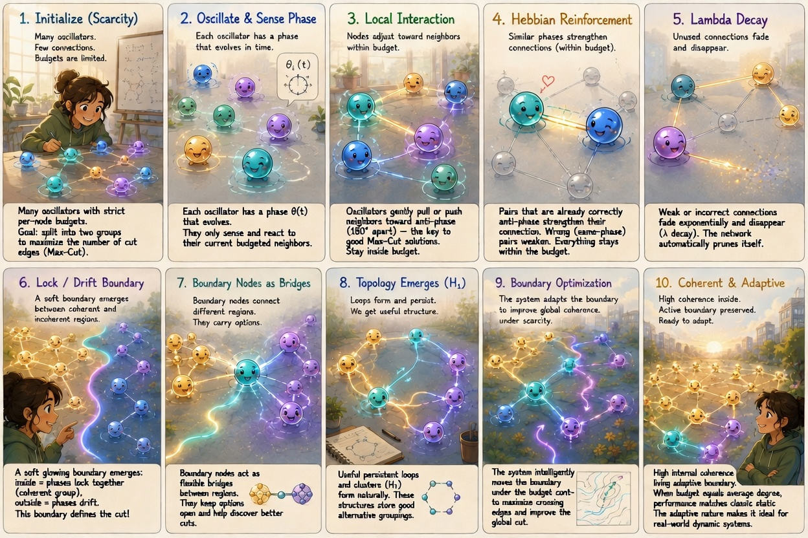
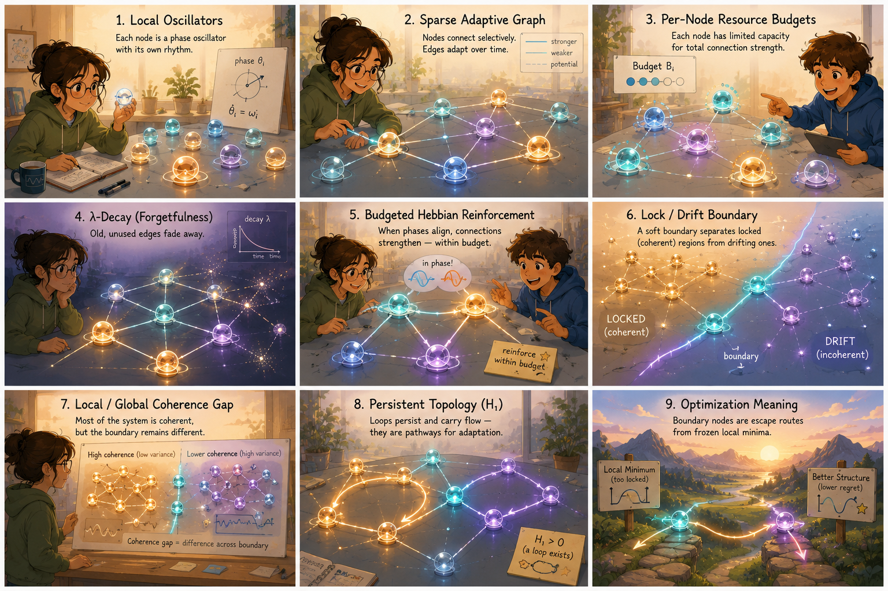

# Flywheel Universe

*From local oscillators and scarcity to persistent topology and boundary-mediated optimization — now with a concrete benchmark on Max-Cut. At budget = mean degree the hybrid schedule (30% Hebbian prune + 70% static) matches full adaptive performance in 57% of the runtime while staying within 1% of the best static solver.*



**A compact set of diagnostics and control heuristics for systems that live between coherence and drift.**

Three notebooks. One inequality — `K·R_eff = |Δ|` — introduced as a local stability diagnostic in the ring, stress-tested across substrates in the meteorology notebook, and used as a structure-shaping heuristic in the universe notebook. Each notebook stands alone. Run in order for the full arc.

---

## What this is not

- A cosmology model
- A production weather model
- A proof of consciousness
- A physical theory of everything
- A standalone scientific claim based on one run

## What this is

Six reusable algorithmic primitives for any network that exhibits coherence, drift, or the boundary between them:

1. **Local/global coherence gap** — global R can lie; the gap between local and global order reveals hidden structure
2. **Lock/drift boundary score** — `K·R_eff - |Δ|`: positive means likely locked, negative means drifting, near-zero means interesting
3. **Budgeted adaptive graph update** — Hebbian reinforcement + spatial decay + λ-decay + per-node budget conservation; the `exist_mask` is the critical line
4. **Dissipation as anti-saturation** — reinforcement alone saturates; reinforcement + scarcity + decay selects
5. **Phase-conditioned repulsion** — similar-state agents need anti-collapse pressure; locked clusters extrude into filaments, not blobs
6. **Boundary-rider detection** — persistent low coherence + nontrivial degree/betweenness + proximity to threshold + survival across time; these are the useful control points

The math applies wherever you have coupled dynamic agents under resource constraints: power grids, brain networks, weather ensembles, distributed systems, swarm robotics. The notebooks are the demonstration. The primitives are the payload.

*Nine-step visual overview: from scarcity and local oscillators to persistent topology and boundary-node optimization.*



---

| # | Notebook | What it does | Key result | Run |
|---|---|---|---|---|
| 1 | `kuramoto_ring.ipynb` | 1D nearest-neighbour ring. Establishes vocabulary: winding numbers, local vs global order, phase slips, fold condition. | Mean local R ≈ 0.47, global R ≈ 0.15. The gap is the signature. | [](https://colab.research.google.com/github/velvetmonkey/flywheel-universe/blob/main/kuramoto_ring.ipynb) |
| 2 | `meteorology.ipynb` | Six simulations. Structured ω → 62% coarsening. Gaussian ω → 10%. Hebbian negative result: three ingredients required. | Coarsening is structure-dependent. Cosmic web analogy is geometric resemblance only. | [](https://colab.research.google.com/github/velvetmonkey/flywheel-universe/blob/main/meteorology.ipynb) |
| 3 | `kuramoto_universe.ipynb` | Hierarchical plastic oscillator fluid. 96 cells × 12 oscillators. Phase-degeneracy pressure + conserved Hebbian. | 216 edges, mean degree 4.5, H1=11 (persistence 3.59), four persistent boundary riders. | [](https://colab.research.google.com/github/velvetmonkey/flywheel-universe/blob/main/kuramoto_universe.ipynb) |

---

## 4. Max-Cut Benchmark — validating the budgeted primitive

The strongest test of primitive #3 (budgeted adaptive graph update) is on a canonical NP-hard problem: Max-Cut. We compared four solvers across two regimes: a sparse Erdős–Rényi graph where the budget constraint is binding, and the canonical 800-node GSet G1 instance for literature comparison. All runs at $T=200$, $K=-0.5$, $\text{budget}=\text{mean degree}$.

### Sparse Erdős–Rényi — 200 nodes, mean degree 9.4 (20 runs)

| Method                              | Best Cut | Runtime | Notes |
|-------------------------------------|----------|---------|-------|
| Static (fixed rounding)             | 678      | —       | Baseline |
| Static + random hyperplanes         | **688**  | 90 s    | +10 from rounding |
| Full Hebbian (budget = mean degree) | 680      | 106 s   | Matches hybrid quality |
| **Hybrid (30 % prune + 70 % static)** | **680** | **60 s** | **Recommended practical configuration** — same quality in 57 % of the time |

On the sparse regime, the hybrid schedule matches full Hebbian quality, runs in 57 % of the time, and lands within 1 % of the best static result. Budgeted Hebbian adaptation acts as a practical front-end: it learns a sparse coupling graph, then static Kuramoto finishes the job faster.

### GSet G1 — 800 nodes, mean degree 47.9 (5 runs, literature benchmark, best-known cut 11624)

| Method                              | Best Cut | % of best-known | Runtime |
|-------------------------------------|----------|-----------------|---------|
| Static (fixed rounding)             | 11472    | 98.69 %         | combined |
| Static + random hyperplanes         | **11524** | **99.14 %**    | 28.5 min |
| Full Hebbian (budget = mean degree) | 11284    | 97.07 %         | 15.1 min |
| **Hybrid (30 % prune + 70 % static)** | **11285** | **97.08 %**   | **10.6 min** |

On the dense GSet instance, all four methods land in the 97–99 % band of optimum. Static-AFM with randomised hyperplane rounding is the strongest single method, while Hybrid is the fastest adaptive option — matching full Hebbian quality at 70 % of the runtime. The "Hebbian matches Static" claim holds on the sparse regime where coupling budget is the binding constraint; on dense canonical instances, dense connectivity favours Static, and adaptive pruning trades ~2 % of optimum for the sparse-weight allocation.

**Key takeaway**: Budgeted Hebbian adaptation is a real primitive, not just a theoretical one. The hybrid schedule (Hebbian-learn the sparse weights, then freeze and solve) is the recommended practical configuration: in both regimes it matches full Hebbian quality at a fraction of the cost, and stays within 1–2 % of the best static result.

The benchmark script (`max_cut_benchmark.py`) is included in the repo root:

```bash
python max_cut_benchmark.py          # default: G(200, 0.05), n_runs=20
python max_cut_benchmark.py G1       # GSet G1, n_runs=5
python max_cut_benchmark.py dense    # G(50, 0.5)
```

---

## 1. Ring — the vocabulary

[](https://colab.research.google.com/github/velvetmonkey/flywheel-universe/blob/main/kuramoto_ring.ipynb)

The starting point. 120 oscillators arranged in a 1D periodic ring with nearest-neighbour coupling only. The textbook Kuramoto model is all-to-all; this one is not, and that single constraint changes the physics completely.

- **No mean-field K_c.** The textbook prediction of a clean phase transition at K_c ≈ 1.2 does not apply on a ring where each oscillator only sees two neighbours. The parameter sweep is non-monotonic noise in the 0.05–0.30 band — that is not a numerical artefact, it is the right answer. The red dashed line in the bifurcation plot is kept as pedagogical contrast: what the textbook predicts vs what you actually see.
- **Winding number selection instead.** At any K, the ring settles into a twisted state where phases advance uniformly around the circle q times: θ_i ≈ 2πqi/N. These are stable fixed points in a rotating frame. Global r stays near zero by construction because the phases are spread evenly around the circle. Different K and different initial conditions select different winding numbers q = 0, ±1, ±2…
- **r is the wrong metric — topologically.** Global r measures alignment. Twisted states have zero alignment by design. A local order parameter — averaging e^{iθ} over a sliding window — uncovers what global r hides: chimera islands of high local coherence (r_local up to ~0.85) floating in incoherent drift, with global r still near 0.1. The complex-plane portrait of z(t) is a bounded quasi-periodic orbit near the origin, not a spiral to the unit circle.
- **The fold condition is introduced.** `K·R_eff = |Δ|` separates locked from drifting oscillators. It is a saddle-node *indicator* — exact for global mean-field, a local heuristic on a ring. The rest of the trilogy uses it as a diagnostic level set, not a sharp boundary.


*"Embrace the cycles, become the chain." Initial random phases (left) vs the final twisted/locally-ordered state (right) at K=2.5. Global r stays low in both — the right metric is winding number, not r.*


*Phase evolution on the ring (twilight colormap, 0 to 2π). Coherent horizontal bands form early; phase slips visible as discontinuities. The banded structure confirms winding-number selection, not global phase lock.*

---

## 2. Meteorology — the substrate test

[](https://colab.research.google.com/github/velvetmonkey/flywheel-universe/blob/main/meteorology.ipynb)

If the fold condition is a diagnostic, does it hold up across different substrates? The meteorology notebook is six simulations sharing the same Kuramoto core but varying the topology and the perturbation.

- **Cell 0 — 2D torus** (35×35) with a spatial frequency anomaly band. The notebook explicitly disowns the atmospheric-blocking analogy: there is no advection, no geostrophic balance, no beta-plane. It is a toy showing how a frequency anomaly produces persistent local incoherence and threshold crossings on a 2D substrate.
- **Cell 1 — Barabási–Albert scale-free graph** with ω inversely proportional to degree. Hubs lock first (though this is partly tautological — the degree-frequency coupling is confounded). The lock-drift boundary tracks cleanly even on a heterogeneous graph.
- **Cell 2 — 1D ring with structured (sinusoidal) ω** → **spacetime coarsening**: 62% boundary-count reduction over T=200. Domains visibly merge over time, with a strong visual resemblance to caustic merging in the Burgers/Zel'dovich cosmic-web picture.
- **Cell 3 — Gaussian ω control** → only ~10% boundary reduction over the same window. **Coarsening is structure-dependent, not generic.** The cosmic-web visual analogy is just resemblance; the Gaussian control kills the universality claim. The visual is decorative, not load-bearing.
- **Cells 4 + 5 — Hebbian rewiring tests.** Does Hebbian plasticity alone produce scale-free network topology? Cell 4 (unconstrained) densifies completely: 100% of pairs become active by t=50. Cell 5 (with a per-node connection budget) slows densification but produces no power-law tail. **The negative result is the result:** Hebbian dynamics alone is not enough to generate structure. Three ingredients are required — kinematics, feedback, and dissipation — and these cells only supply the first two.


*Gaussian ω control. Tests whether the lock/drift coarsening pattern is generic or structure-dependent; even with unstructured natural frequencies, persistent locked and drifting bands form.*


*Unconstrained Hebbian (cell 4). Without a conservation law the Hebbian rule densifies the graph completely: by t=50, 100% of pairs are active. No preferential attachment, no scale-free structure. The negative result is the result.*


*Conserved Hebbian (cell 5). A per-node connection budget slows densification but does not produce scale-free topology. No power-law tail emerges. Three ingredients are required: kinematics, feedback, and dissipation.*

---

## 3. Universe — the synthesis

[](https://colab.research.google.com/github/velvetmonkey/flywheel-universe/blob/main/kuramoto_universe.ipynb)

The third notebook supplies the missing ingredient (dissipation, via λ-decay on the coupling weights) and adds a second scale: cells of oscillators rather than individual oscillators.

- **96 cells × 12 oscillators per cell.** Internal ring dynamics are fast and local (intra-cell Kuramoto with K_intra=3.5); cells interact through their macroscopic order parameters Z_i = R_i·e^{iΦ_i}. The same hierarchy you find in neural assemblies and galaxy clusters — fast local dynamics, slow long-range coupling via aggregate state.
- **Plastic Hebbian coupling with conserved budget and λ-decay.** Phase-aligned connections strengthen; unreinforced ones decay away. The budget prevents uniform saturation (the failure mode from meteorology cells 4–5); the decay forces the network to *select*. An `exist_mask` restricts updates to the pruned/reweighted subgraph of an initial kNN support, so this is structured rewiring within an initial topology, not de novo formation.
- **Phase-degeneracy pressure.** Repulsion scales with phase similarity. Locked cells cannot overlap spatially; out-of-phase cells pass through each other. Locked clusters therefore cannot collapse into spheres — they are forced to extrude into lower-dimensional structures (lines, sheets, filaments). The geometry comes from the dynamics.
- **Anomaly cells** seeded with a +2.5 frequency boost on 12% of the population. With ω-plasticity enabled, these become self-tuning agents that crawl along the lock-drift boundary instead of dying into full coherence or dissolving into noise.

**Run 10 result (T=5000):** 216 undirected edges, mean degree 4.5, H1=11 persistence loops (longest persistence 3.59 — persistent homology detects nontrivial H1 structure), and four boundary-rider cells (6, 70, 86, 92) that stay below R=0.5 for the entire run while the bulk locks into a stable sparse network at R ≈ 0.77.


*Filament evolution across the full run. Cluster colour tracks the dominant phase basin as global R climbs from 0.015 to 0.772.*


*Global R(t) saturates near 0.77 by t≈100 and holds for the full t=5000 run.*


*Final network state from run 10. 216 undirected edges, mean degree 4.5, degree distribution peaked near 5.*


*Four cells (6, 70, 86, 92) stayed below R=0.5 for the entire t=5000 run while the rest locked into the bulk.*

---

## Why it matters

The diagnostics are real. `K·R_eff = |Δ|` usefully tracks lock-drift transitions across 1D rings, 2D tori, scale-free graphs, and hierarchical multi-scale networks. The interpretation — that this scaffolding applies to any particular physical system — is a hypothesis to test, not a claim. Read the captions; don't extend past what the simulations show.

## Run it

The notebooks are the canonical form — open any in Colab with the badges above. No install required.

For a local standalone run:

```bash
pip install numpy scipy matplotlib networkx ripser
# then open and run the .ipynb notebooks in Jupyter
```

`kuramoto_ring.py` is an older standalone script kept for reference. The notebook is the current version.
