# Flywheel Universe

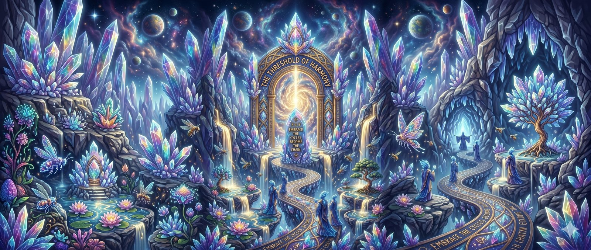

> embrace the cycles.
> become the chain.

**Three notebooks exploring a single question: what does structure look like when it emerges from phase dynamics under scarcity?**

The through-line is one inequality — `K·R_eff = |Δ|` — introduced as a diagnostic in the ring, stress-tested across substrates in the meteorology notebook, and treated as a structure-selecting operator in the universe notebook. Each notebook stands alone. Run in order for the full arc.

---

| # | Notebook | What it does | Key result | Run |
|---|---|---|---|---|
| 1 | `kuramoto_ring.ipynb` | 1D nearest-neighbour ring. Establishes vocabulary: winding numbers, local vs global order, phase slips, fold condition. | Mean local R ≈ 0.47, global R ≈ 0.15. The gap is the signature. | [](https://colab.research.google.com/github/velvetmonkey/flywheel-universe/blob/main/kuramoto_ring.ipynb) |
| 2 | `meteorology.ipynb` | Six simulations. Structured ω → 62% coarsening. Gaussian ω → 10%. Hebbian negative result: three ingredients required. | Coarsening is structure-dependent. Cosmic web analogy is geometric resemblance only. | [](https://colab.research.google.com/github/velvetmonkey/flywheel-universe/blob/main/meteorology.ipynb) |
| 3 | `kuramoto_universe.ipynb` | Hierarchical plastic oscillator fluid. 96 cells × 12 oscillators. Phase-degeneracy pressure + conserved Hebbian. | 216 edges, mean degree 4.5, H1=11 (persistence 3.59), four persistent boundary riders. | [](https://colab.research.google.com/github/velvetmonkey/flywheel-universe/blob/main/kuramoto_universe.ipynb) |

---

## 1. Ring — the vocabulary

[](https://colab.research.google.com/github/velvetmonkey/flywheel-universe/blob/main/kuramoto_ring.ipynb)

The starting point. 120 oscillators arranged in a 1D periodic ring with nearest-neighbour coupling only. The textbook Kuramoto model is all-to-all; this one is not, and that single constraint changes the physics completely.

- **No mean-field K_c.** The textbook prediction of a clean phase transition at K_c ≈ 1.2 does not apply on a ring where each oscillator only sees two neighbours. The parameter sweep is non-monotonic noise in the 0.05–0.30 band — that is not a numerical artefact, it is the right answer. The red dashed line in the bifurcation plot is kept as pedagogical contrast: what the textbook predicts vs what you actually see.
- **Winding number selection instead.** At any K, the ring settles into a twisted state where phases advance uniformly around the circle q times: θ_i ≈ 2πqi/N. These are stable fixed points in a rotating frame. Global r stays near zero by construction because the phases are spread evenly around the circle. Different K and different initial conditions select different winding numbers q = 0, ±1, ±2…
- **r is the wrong metric — topologically.** Global r measures alignment. Twisted states have zero alignment by design. A local order parameter — averaging e^{iθ} over a sliding window — uncovers what global r hides: chimera islands of high local coherence (r_local up to ~0.85) floating in incoherent drift, with global r still near 0.1. The complex-plane portrait of z(t) is a bounded quasi-periodic orbit near the origin, not a spiral to the unit circle.
- **The fold condition is introduced.** `K·R_eff = |Δ|` separates locked from drifting oscillators. It is a saddle-node *indicator* — exact for global mean-field, a local heuristic on a ring. The rest of the trilogy uses it as a diagnostic level set, not a sharp boundary.

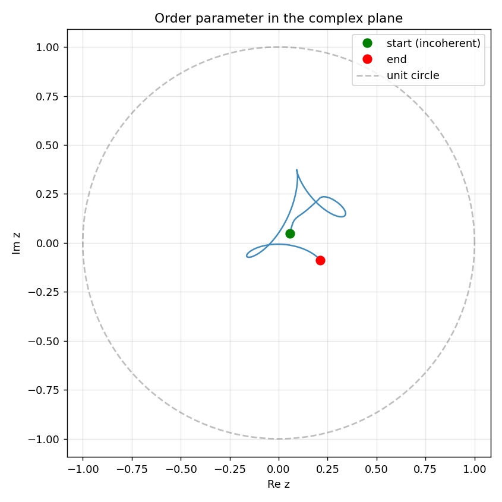

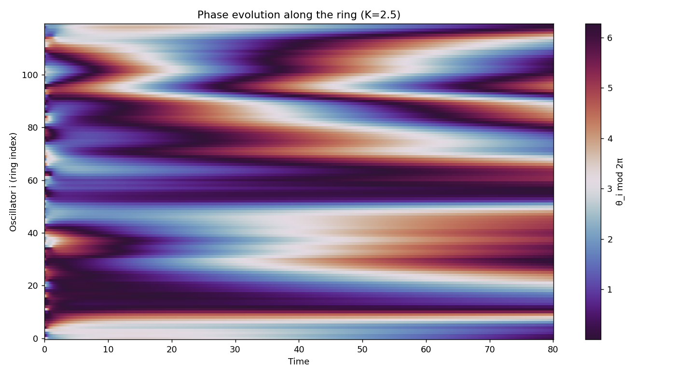

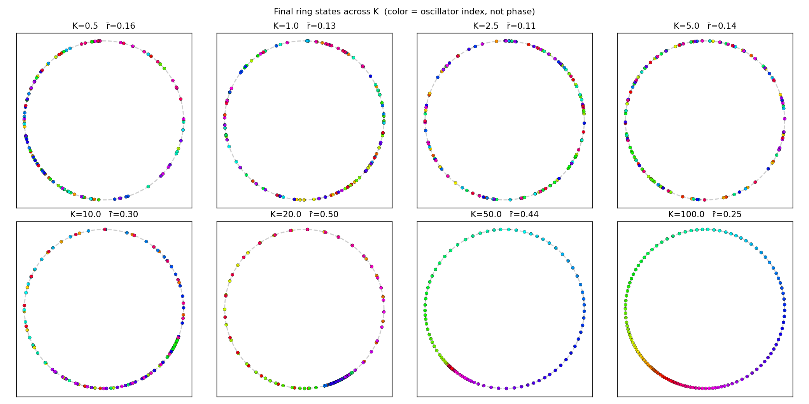

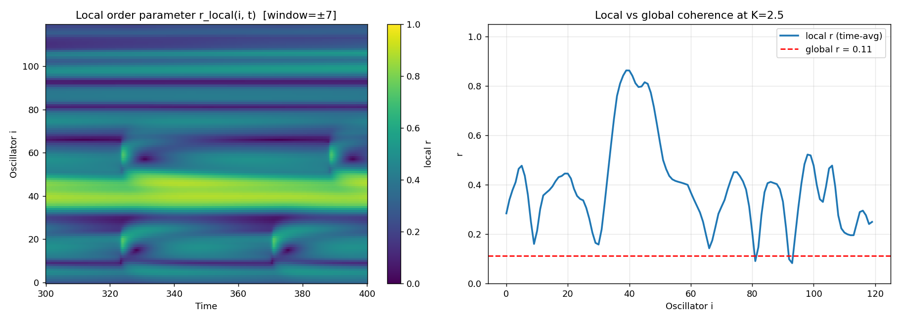

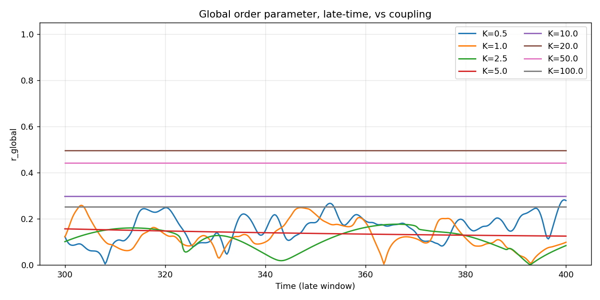

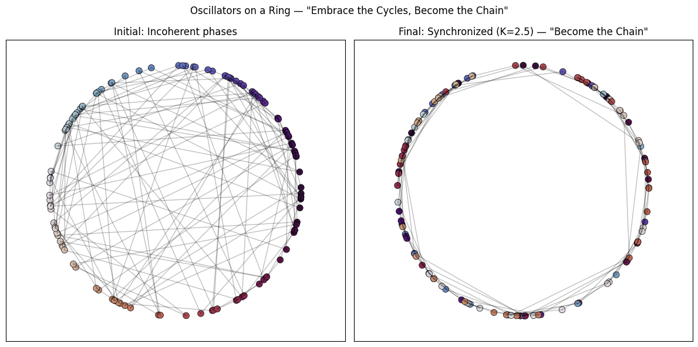

*"Embrace the cycles, become the chain." Initial random phases (left) vs the final twisted/locally-ordered state (right) at K=2.5. Global r stays low in both — the right metric is winding number, not r.*

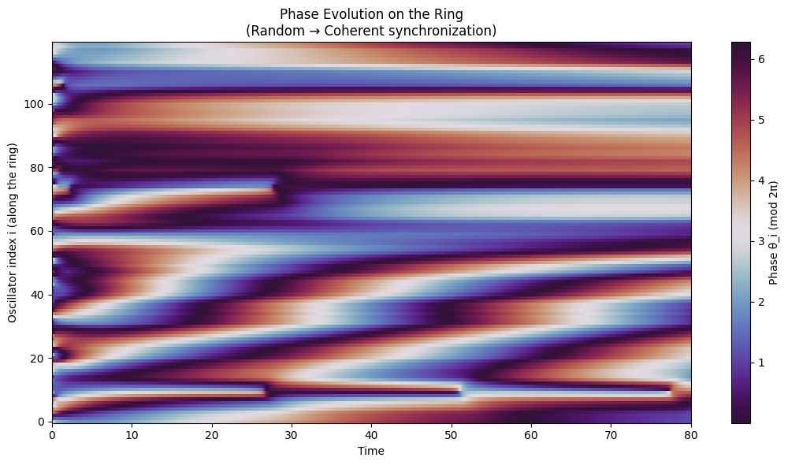

*Phase evolution on the ring (twilight colormap, 0 to 2π). Coherent horizontal bands form early; phase slips visible as discontinuities. The banded structure confirms winding-number selection, not global phase lock.*

---

## 2. Meteorology — the substrate test

[](https://colab.research.google.com/github/velvetmonkey/flywheel-universe/blob/main/meteorology.ipynb)

If the fold condition is a diagnostic, does it hold up across different substrates? The meteorology notebook is six simulations sharing the same Kuramoto core but varying the topology and the perturbation.

- **Cell 0 — 2D torus** (35×35) with a spatial frequency anomaly band. The notebook explicitly disowns the atmospheric-blocking analogy: there is no advection, no geostrophic balance, no beta-plane. It is a toy showing how a frequency anomaly produces persistent local incoherence and threshold crossings on a 2D substrate.
- **Cell 1 — Barabási–Albert scale-free graph** with ω inversely proportional to degree. Hubs lock first (though this is partly tautological — the degree-frequency coupling is confounded). The lock-drift boundary tracks cleanly even on a heterogeneous graph.
- **Cell 2 — 1D ring with structured (sinusoidal) ω** → **spacetime coarsening**: 62% boundary-count reduction over T=200. Domains visibly merge over time, with a strong visual resemblance to caustic merging in the Burgers/Zel'dovich cosmic-web picture.
- **Cell 3 — Gaussian ω control** → only ~10% boundary reduction over the same window. **Coarsening is structure-dependent, not generic.** The cosmic-web visual analogy is just resemblance; the Gaussian control kills the universality claim. The visual is decorative, not load-bearing.
- **Cells 4 + 5 — Hebbian rewiring tests.** Does Hebbian plasticity alone produce scale-free network topology? Cell 4 (unconstrained) densifies completely: 100% of pairs become active by t=50. Cell 5 (with a per-node connection budget) slows densification but produces no power-law tail. **The negative result is the result:** Hebbian dynamics alone is not enough to generate structure. Three ingredients are required — kinematics, feedback, and dissipation — and these cells only supply the first two.

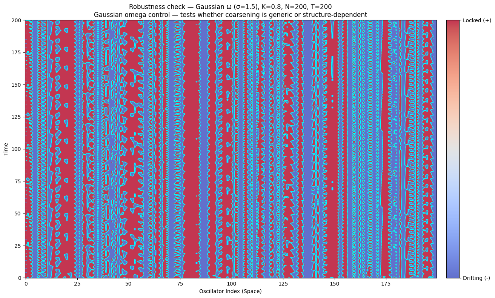

*Gaussian ω control. Tests whether the lock/drift coarsening pattern is generic or structure-dependent; even with unstructured natural frequencies, persistent locked and drifting bands form.*

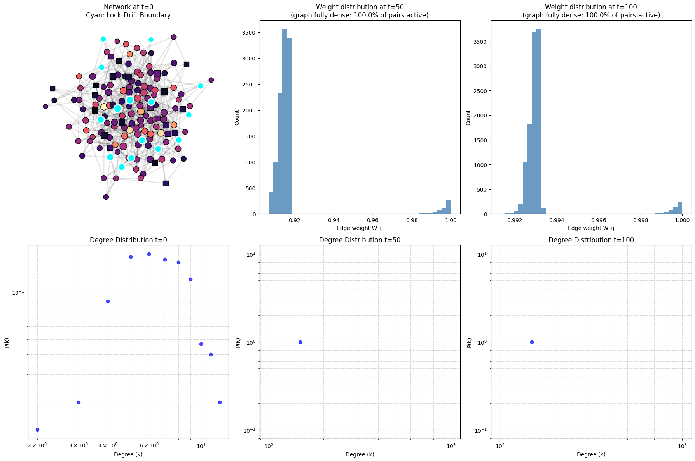

*Unconstrained Hebbian (cell 4). Without a conservation law the Hebbian rule densifies the graph completely: by t=50, 100% of pairs are active. No preferential attachment, no scale-free structure. The negative result is the result.*

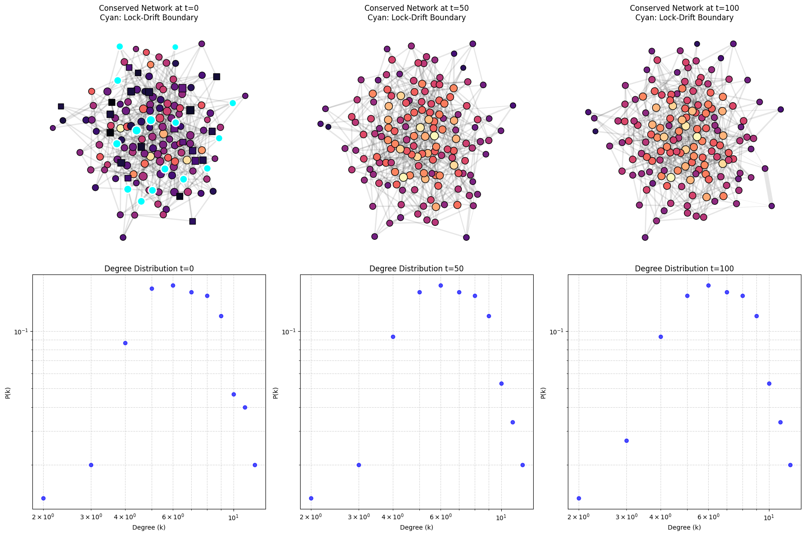

*Conserved Hebbian (cell 5). A per-node connection budget slows densification but does not produce scale-free topology. No power-law tail emerges. Three ingredients are required: kinematics, feedback, and dissipation.*

---

## 3. Universe — the synthesis

[](https://colab.research.google.com/github/velvetmonkey/flywheel-universe/blob/main/kuramoto_universe.ipynb)

The third notebook supplies the missing ingredient (dissipation, via λ-decay on the coupling weights) and adds a second scale: cells of oscillators rather than individual oscillators.

- **96 cells × 12 oscillators per cell.** Internal ring dynamics are fast and local (intra-cell Kuramoto with K_intra=3.5); cells interact through their macroscopic order parameters Z_i = R_i·e^{iΦ_i}. The same hierarchy you find in neural assemblies and galaxy clusters — fast local dynamics, slow long-range coupling via aggregate state.
- **Plastic Hebbian coupling with conserved budget and λ-decay.** Phase-aligned connections strengthen; unreinforced ones decay away. The budget prevents uniform saturation (the failure mode from meteorology cells 4–5); the decay forces the network to *select*. An `exist_mask` restricts updates to the pruned/reweighted subgraph of an initial kNN support, so this is structured rewiring within an initial topology, not de novo formation.
- **Phase-degeneracy pressure.** Repulsion scales with phase similarity. Locked cells cannot overlap spatially; out-of-phase cells pass through each other. Locked clusters therefore cannot collapse into spheres — they are forced to extrude into lower-dimensional structures (lines, sheets, filaments). The geometry comes from the dynamics.
- **Anomaly cells** seeded with a +2.5 frequency boost on 12% of the population. With ω-plasticity enabled, these become self-tuning agents that crawl along the lock-drift boundary instead of dying into full coherence or dissolving into noise.

**Run 10 result (T=5000):** 216 undirected edges, mean degree 4.5, H1=11 persistence loops (longest persistence 3.59 — filamentary structure confirmed by persistent homology), and four boundary-rider cells (6, 70, 86, 92) that stay below R=0.5 for the entire run while the bulk locks into a stable sparse network at R ≈ 0.77. The fold condition K·R_eff = |Δ| no longer describes a single substrate; it describes which structures the multi-scale system *selects* and which cells live on the boundary of that selection.

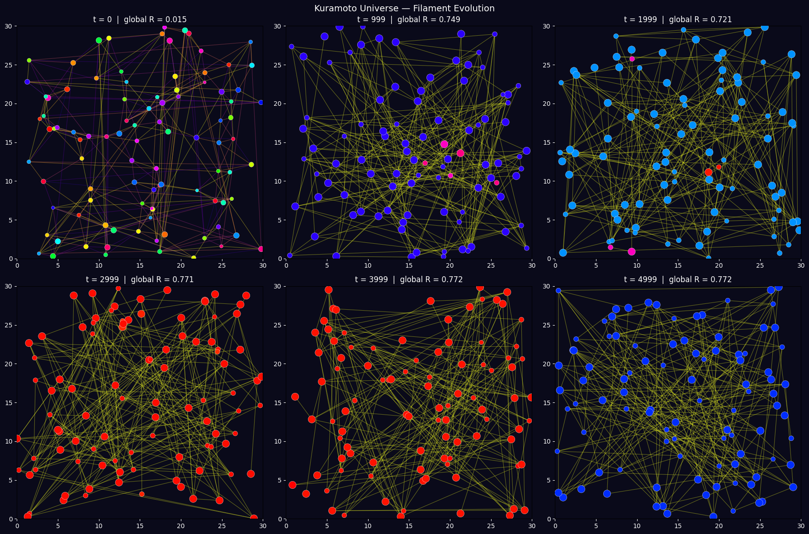

*Filament evolution across the full run. Cluster colour tracks the dominant phase basin (rainbow → blue → red → orange → blue) as global R climbs from 0.015 to 0.772.*

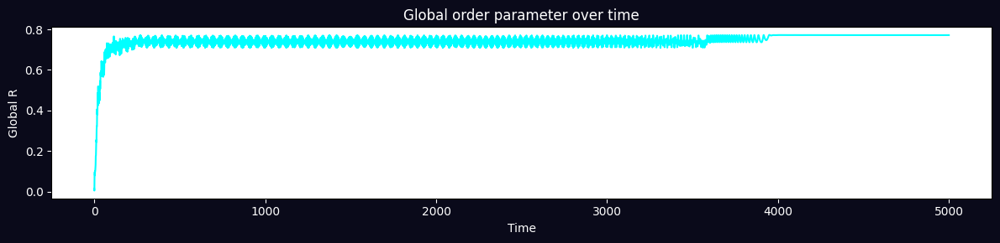

*Global R(t) saturates near 0.77 by t≈100 and holds for the full t=5000 run, with one brief excursion near t≈3500.*

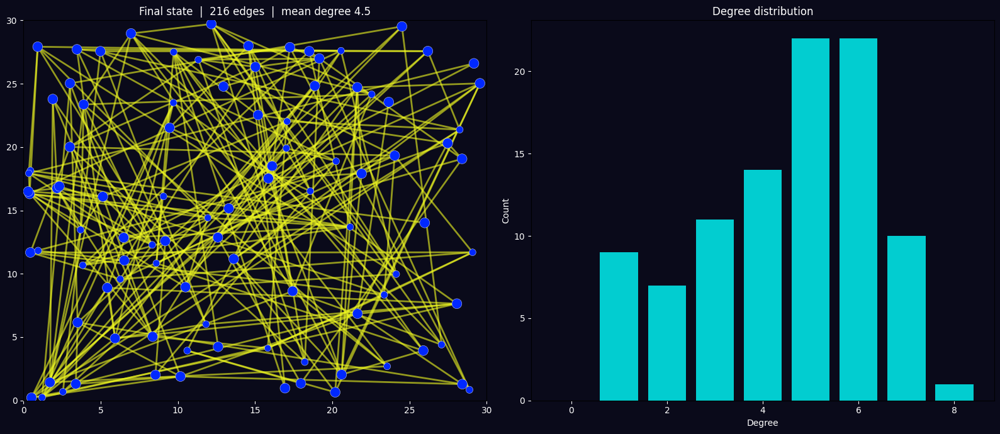

*Final network state from run 10. 216 undirected edges, mean degree 4.5, degree distribution peaked near 5.*

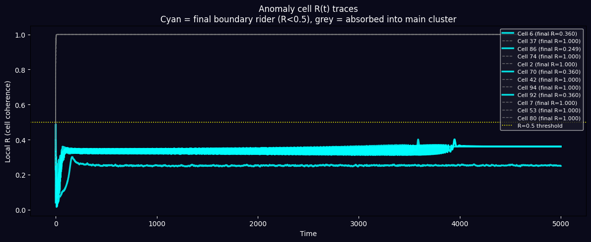

*Four cells (6, 70, 86, 92) stayed below R=0.5 for the entire t=5000 run while the rest locked into the bulk. 100% fraction_below_0.5 throughout — these are the persistent boundary riders flagged in the commit log.*

---

## Other visuals

*Adjacent imagery — not outputs of the trilogy notebooks. Included as conceptual neighbours (attractor geometry, heteroclinic chains, Stuart–Landau normal form, McKay/affine-E8, OPH-inspired). Decorative, not load-bearing.*

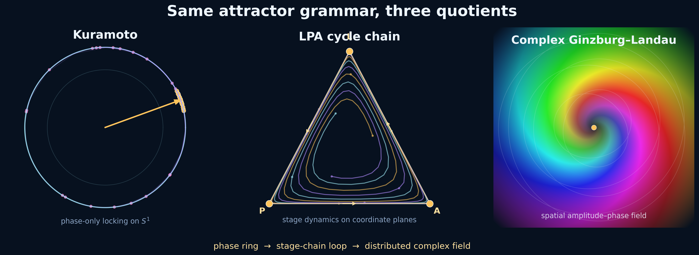

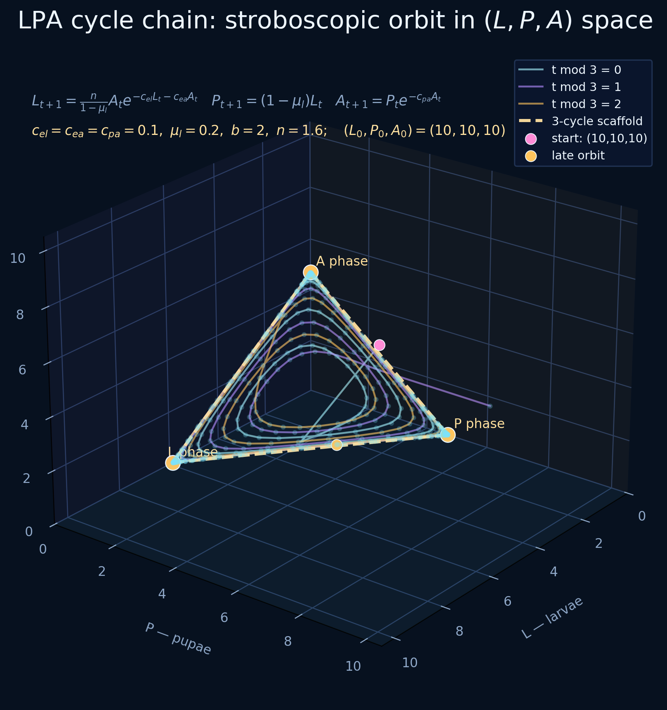

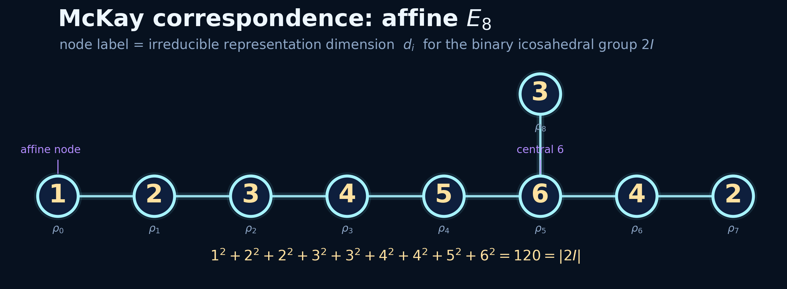

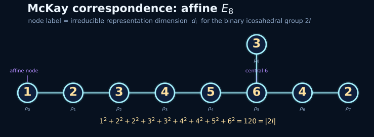

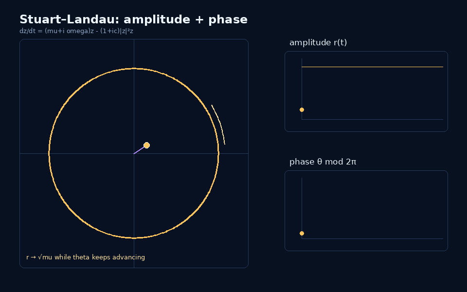

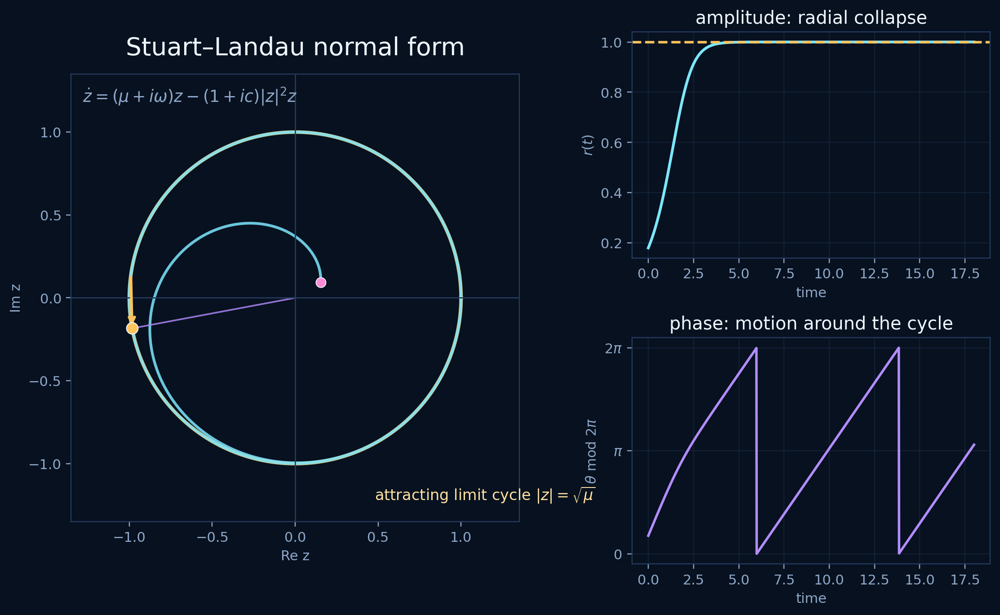

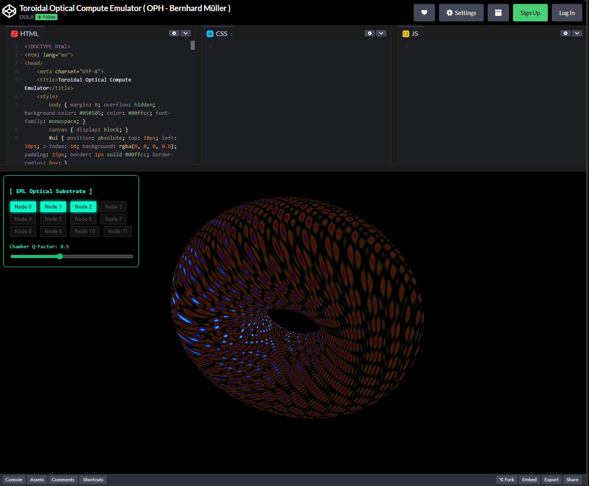

---

## Why it matters

The diagnostic is real. The trilogy shows that `K·R_eff = |Δ|` usefully tracks lock-drift transitions across 1D rings, 2D tori, scale-free graphs, structured vs Gaussian frequency distributions, and hierarchical multi-scale networks. Chimera states, twisted attractors, and boundary riders are well-studied dynamical-systems objects (Kuramoto–Battogtokh 2002, Abrams–Strogatz 2004) with a live literature on metastable patterns in EEG/fMRI (Bansal, Bassett, Schöll, Omelchenko). That part is engineering — the math is what the math is.

The interpretation — that this scaffolding gives an executable geometry for partial coherence in mind-like or cosmology-like systems — is **a direction, not yet a result.** The chimera-state-as-mind reading sits next to the math without ground-truth verification, and the cosmic-web visual analogue is killed by the meteorology Gaussian control. Read the captions, don't believe the framing past what the simulations actually show.

## Run it

```bash
pip install numpy scipy matplotlib
python kuramoto_ring.py
```

## Related

**Own work:**

- Universe feature/bug task: [zenodo.org/records/20179566](https://zenodo.org/records/20179566)

**Potential collaborators — independent work, listed for context, not endorsement:**

- FloatingPragma — observer-patch holography (theory): [github.com/FloatingPragma/observer-patch-holography](https://github.com/FloatingPragma/observer-patch-holography)
- Dula (DULA2025) — OPH toroidal emulator (visualization): [codepen.io/DULA2025/pen/LERMgxv](https://codepen.io/DULA2025/pen/LERMgxv)
- Dula (DULA2025) — Prime Inertia Engine: [codepen.io/DULA2025/pen/yyVejbr](https://codepen.io/DULA2025/pen/yyVejbr) · [github.com/DULA2025/prime-inertia-engine](https://github.com/DULA2025/prime-inertia-engine)
- dmytronic — preprint *Logic Instantiated in Time is Ontically Experienced*: [zenodo.org/records/20233225](https://zenodo.org/records/20233225)

*These are researchers whose work intersects thematically. Inclusion is for context, not endorsement; connections are speculative and the work is unverified by this author.*

## Source

```python
import numpy as np
import matplotlib.pyplot as plt
from scipy.integrate import solve_ivp
import matplotlib.cm as cm

# ================================================
# Kuramoto Model on a Ring (1D periodic chain)
# Nearest-neighbor coupling — exactly as requested
# ================================================

def kuramoto(t, theta, omega, K, N=None):
    """
    Right-hand side of Kuramoto ODE on a ring (nearest-neighbor coupling).
    Vectorized: np.roll handles the periodic ±1 neighbour shifts in one shot,
    ~10x faster than the python for-loop on the bifurcation sweep.
    N is unused (kept for backward-compatible signature).
    """
    return omega + K * (np.sin(np.roll(theta, -1) - theta) + np.sin(np.roll(theta, 1) - theta))


def order_parameter(theta):
    """Compute magnitude of complex order parameter r"""
    z = np.mean(np.exp(1j * theta))
    return np.abs(z)


# Parameters (tuned for clear visuals + reasonable runtime)
N = 120                    # Number of oscillators on the ring
np.random.seed(42)
omega = np.random.normal(0.0, 0.65, N)   # Natural frequencies (Gaussian spread)

t_span = (0, 150)
t_eval_long = np.linspace(0, 150, 3000)

# ------------------------------------------------
# 1. Bifurcation diagram: order parameter r vs K
# ------------------------------------------------
print("Computing bifurcation diagram...")
K_values = np.linspace(0.0, 4.0, 35)
r_final = []

for K in K_values:
    theta0 = np.random.uniform(0, 2*np.pi, N)
    sol = solve_ivp(kuramoto, t_span, theta0, args=(omega, K, N),
                    method='RK45', rtol=1e-6, atol=1e-8)
    theta_final = sol.y[:, -1]
    r = order_parameter(theta_final)
    r_final.append(r)
    print(f"K = {K:.2f}  →  r = {r:.3f}")

# Plot bifurcation
plt.figure(figsize=(9, 5))
plt.plot(K_values, r_final, 'o-', linewidth=2, markersize=4)
# Pedagogical contrast: overlay where mean-field theory *would* predict K_c.
# Nothing actually happens at K=1.2 on a nearest-neighbour ring — the line is
# kept to make the absence of a transition visible against the textbook claim.
plt.axvline(x=1.2, color='red', linestyle='--', alpha=0.3, label='Mean-field K_c (does not apply here)')
plt.xlabel('Coupling strength K')
plt.ylabel('Order parameter r')
plt.title('Bifurcation Diagram — Kuramoto Oscillators on a Ring')
plt.grid(True, alpha=0.5)
plt.legend()
plt.tight_layout()
plt.show()

# ------------------------------------------------
# 2. Simulation at K = 2.5 — chimera / twisted regime
# ------------------------------------------------
K_chimera = 2.5   # Intermediate coupling — chimera states and twisted attractors live here

theta0 = np.random.uniform(0, 2*np.pi, N)
sol = solve_ivp(kuramoto, t_span, theta0, args=(omega, K_chimera, N),
                method='RK45', dense_output=True, rtol=1e-6, atol=1e-8)

t_plot = np.linspace(0, 80, 1200)

# Compute order parameter trajectory
R_real = []
R_imag = []
r_time = []

for t in t_plot:
    theta_t = sol.sol(t)
    z = np.mean(np.exp(1j * theta_t))
    R_real.append(z.real)
    R_imag.append(z.imag)
    r_time.append(np.abs(z))

R_real = np.array(R_real)
R_imag = np.array(R_imag)

# ------------------------------------------------
# 3. Plots (exactly what you asked for)
# ------------------------------------------------

# A. Time evolution of order parameter r(t)
plt.figure(figsize=(8, 4))
plt.plot(t_plot, r_time, linewidth=2.5)
plt.xlabel('Time')
plt.ylabel('Order parameter r(t)')
plt.title(f'Time evolution of order parameter r(t)  (K = {K_chimera})')
plt.grid(True, alpha=0.5)
plt.ylim(0, 1.05)
plt.tight_layout()
plt.show()

# B. Phase portrait: Order parameter in complex plane
#     → This is the spiraling/winding-path "portal" visualization
plt.figure(figsize=(7, 7))
plt.plot(R_real, R_imag, 'b-', linewidth=1.8, alpha=0.85, label='Trajectory')
plt.plot(R_real[0], R_imag[0], 'go', markersize=8, label='Initial (incoherent)')
plt.plot(R_real[-1], R_imag[-1], 'ro', markersize=8, label='Final (chimera/twisted state)')
plt.xlabel('Re(R)')
plt.ylabel('Im(R)')
plt.title('Phase Portrait of the Order Parameter\nQuasi-periodic orbit — not a spiral to sync')
plt.axis('equal')
plt.grid(True, alpha=0.4)
plt.legend()
plt.tight_layout()
plt.show()

# C. Phase evolution heatmap (shows "become the chain")
theta_sol = np.array([sol.sol(t) for t in t_plot]).T   # shape (N, len(t_plot))
phases_wrapped = theta_sol % (2 * np.pi)

plt.figure(figsize=(11, 6))
plt.pcolormesh(t_plot, np.arange(N), phases_wrapped, cmap='twilight_shifted', shading='auto')
plt.colorbar(label='Phase θ_i (mod 2π)')
plt.xlabel('Time')
plt.ylabel('Oscillator index i (along the ring)')
plt.title('Phase Evolution on the Ring\n(Random → chimera bands floating in drift)')
plt.tight_layout()
plt.show()

# D. Ring visualization at beginning and end (the "crystal chain")
def plot_ring(theta, title, ax):
    x = np.cos(theta)
    y = np.sin(theta)
    # Scatter oscillators colored by phase
    sc = ax.scatter(x, y, c=theta, cmap='twilight_shifted', s=60, edgecolor='black', linewidth=0.5)
    # Connect nearest neighbors to show the "chain"
    for i in range(N):
        ax.plot([x[i], x[(i+1)%N]], [y[i], y[(i+1)%N]], 'k-', alpha=0.25, linewidth=1)
    ax.set_title(title)
    ax.axis('equal')
    ax.set_xticks([])
    ax.set_yticks([])
    return sc

fig, (ax1, ax2) = plt.subplots(1, 2, figsize=(12, 6))
theta_init = theta0
theta_final = sol.sol(t_plot[-1])

plot_ring(theta_init, 'Initial: Incoherent phases', ax1)
plot_ring(theta_final, f'Final ring state (K={K_chimera}) — twisted/chimera, not global sync', ax2)
plt.suptitle('Oscillators on a Ring — winding number selection and chimera states')
plt.tight_layout()
plt.show()

print("\nSimulation complete. Phase heatmap + ring plot show the chimera/twisted geometry; r alone does not.")
```
